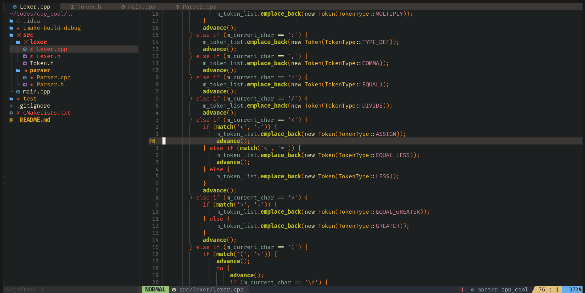
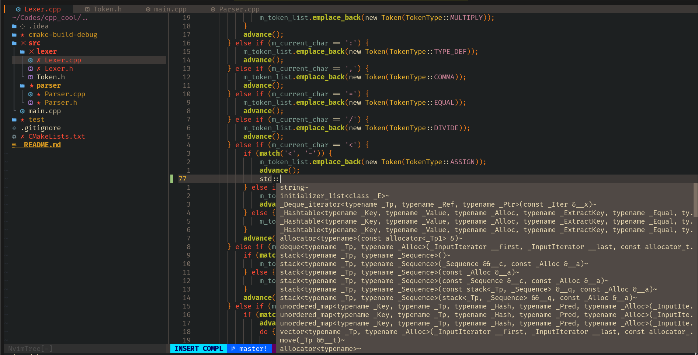
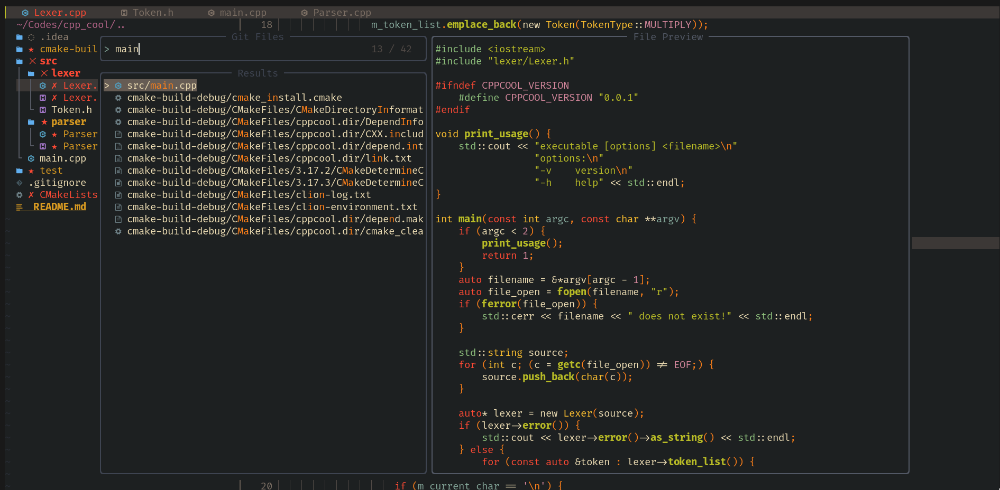

# dotfiles

This repository contains configurations for my setup.

# Neovim

* Neovim - Gruvbox colorscheme with Treesitter support:

* LSP and nvim-comple for autocompletion:

* Find a file with Telescope:

